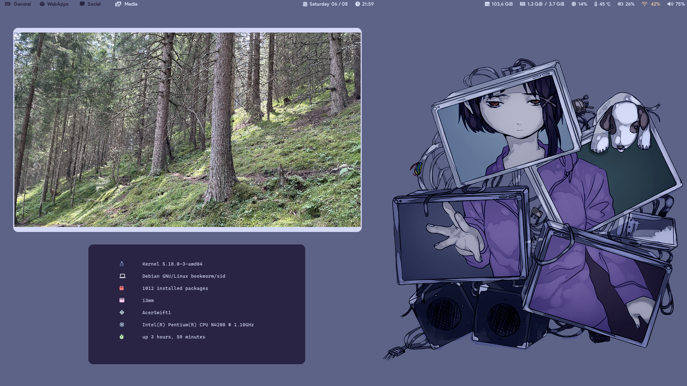

# Overview
This repository contains a relatively small amount of configuration files and scripts with the purpose of creating a minimal i3 desktop setup.
## Software Requirements
- [play with mpv](https://github.com/Thann/play-with-mpv)
- [picom](https://github.com/yshui/picom)
- [gallery-dl](https://github.com/mikf/gallery-dl)
- lxterminal
- nsxiv
- mpv
- google-chrome
- git
- redshift
- maim
- nitrogen
## Final Result

