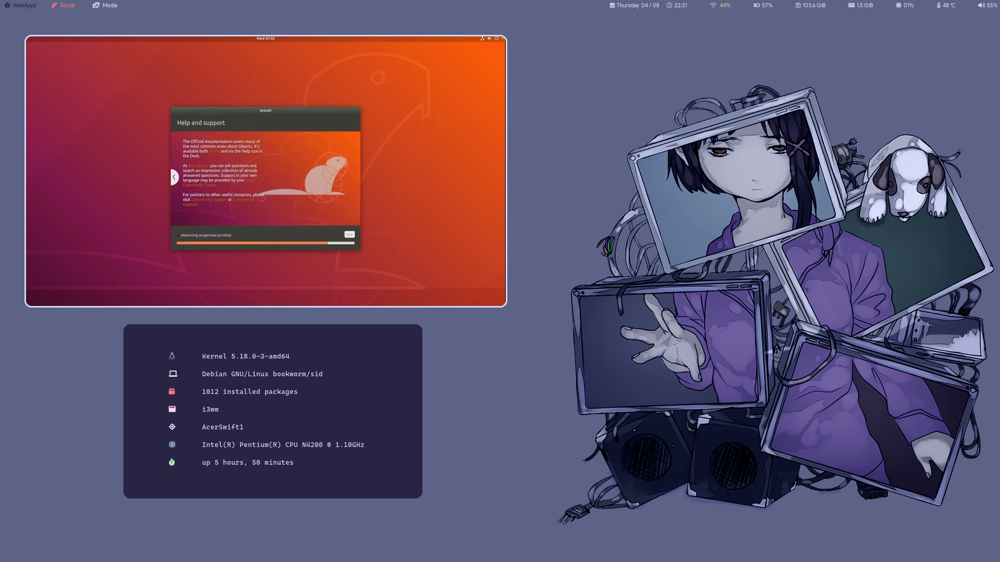

# Repository of configuration files for a minimal i3 setup
## Suggestions
1. Set user name as 'mattia'
## Software Requirements
- [play with mpv](https://github.com/Thann/play-with-mpv)
- [picom](https://github.com/yshui/picom)
- [gallery-dl](https://github.com/mikf/gallery-dl)
- [fontawesome](https://fontawesome.com/docs/desktop/)
- sxiv
- mpv
- google-chrome
- git
- redshift
- scrot
## Final Result

